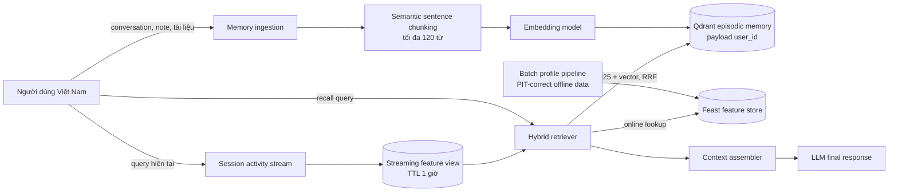

# Hybrid Memory cho trợ lý AI cá nhân

**Contributor:** Hồ Ngọc Quỳnh — Cohort A20-K4, Path Lite  
**Phạm vi:** POC local, không gọi LLM thật; `recall()` tạo context sẵn để đưa vào LLM.

## Kiến trúc và luồng dữ liệu

Nội dung không cấu trúc đi vào Qdrant; thuộc tính typed cần nhất quán train/serve đi vào Feast. Khi recall, Qdrant filter `user_id`. BM25 và vector tạo hai danh sách, rồi RRF `1/(60 + rank)` ghép chúng mà không cần chuẩn hóa điểm. Feast trả profile và query velocity. Context assembler chỉ lấy ba memory tốt nhất để giới hạn token.

## Quyết định 1 — chunk episodic memory

Tôi chọn **ngắt ở biên câu và gom tối đa 120 từ**, thay vì một point cho mỗi message hoặc toàn bộ conversation. Per-message rẻ và giữ đúng speaker turn nhưng câu như “đúng, làm theo cách đó” mất chủ ngữ, làm retrieval kém. Per-conversation giữ đủ ngữ cảnh nhưng vector bị pha nhiều chủ đề, cập nhật lại tốn chi phí và một hit có thể chiếm gần hết context window. Semantic break bằng một model riêng có chất lượng tốt hơn với tài liệu dài, đổi lại tăng latency ingestion và thêm dependency.

Mốc 120 từ đủ rộng để giữ một ý, đủ nhỏ để top-3 không làm phình context và giới hạn storage. Production sẽ thêm overlap 15–20 từ cùng metadata. Với tiếng Việt, token LLM không tương ứng một từ; đếm whitespace chỉ là proxy. Tôi không dùng `pyvi`/`underthesea` để Path Lite nhẹ, nhưng production cần đánh giá tokenizer trên từ ghép như “điện toán đám mây”.

## Quyết định 2 — schema feature

Tôi chọn **tabular, typed features** thay vì embedding profile tiềm ẩn. Embedding có thể học sở thích tinh tế từ lịch sử, nhưng khó giải thích, khó sửa khi người dùng yêu cầu quên dữ liệu, và dễ trộn tín hiệu nhạy cảm. Năm feature sau đủ cho một POC cá nhân hóa có thể quan sát:

| Feature view / feature | Entity | TTL | Source và nhịp cập nhật |
|---|---|---:|---|
| `user_profile`: `preferred_language`, `reading_speed_wpm`, `topic_affinity` | `user_id` | 30 ngày | hồ sơ + hành vi tổng hợp, batch hằng ngày |
| `query_velocity`: `queries_last_hour`, `distinct_topics_24h` | `user_id` | 1 giờ | event query, streaming |
| session overlay: ba query gần nhất | `user_id` | một phiên | bộ đệm tiến trình, cập nhật tức thời |

Tabular feature dùng trực tiếp trong prompt: ngôn ngữ quyết định cách trả lời, tốc độ đọc điều chỉnh độ dài, affinity hỗ trợ recommendation. Training phải dùng Feast **point-in-time join** để mẫu ở `t` không nhìn thấy profile tương lai. TTL 30 ngày phù hợp profile đổi chậm; TTL một giờ ngăn activity cũ giả làm quan tâm hiện tại.

## Quyết định 3 — freshness theo use case

Không có một SLA chung cho mọi memory. Thứ nhất, tài liệu user vừa đọc phải được embed/upsert **sub-second đến vài giây** sau khi lưu; nếu hỏi ngay “trợ lý nhớ gì về tôi?”, việc thiếu tài liệu mới phá vỡ kỳ vọng trực tiếp. Thứ hai, `queries_last_hour` và topic spike dùng streaming Push API, mục tiêu **dưới một phút**; POC mô phỏng bằng session overlay tức thời, trong khi Feast giữ aggregate đã materialize. Thứ ba, reading speed và topic affinity ổn định chỉ cần **batch hằng ngày**; refresh mỗi query vừa đắt vừa khiến profile dao động vì một hành vi ngẫu nhiên. Một dashboard recommendation ít khẩn cấp có thể dùng micro-batch **5 phút**, nằm giữa hai mức trên.

Tradeoff là freshness càng cao thì chi phí stream, write amplification và vận hành càng lớn. Tôi chỉ trả chi phí sub-second cho read-your-writes, dùng stream cho activity có TTL ngắn, và batch cho thuộc tính chậm. Offline training vẫn dùng event timestamp và PIT join, không lấy snapshot online hiện tại để “du hành thời gian”.

## Lựa chọn đã loại bỏ và bối cảnh Việt Nam

Tôi đã cân nhắc lưu episodic embedding trong Feast, nhưng chọn Qdrant riêng vì memory cần similarity search, payload filter và re-index theo embedding model; Feast phù hợp typed lookup theo entity và có chu kỳ materialize khác. Ghép chúng ở request time giữ mỗi hệ thống đúng vai trò.

Query tiếng Việt thường code-switch như “recommend tài liệu cloud”, không dấu (“bao mat dam may”), viết tắt và sai chính tả. BM25 whitespace giữ nguyên thuật ngữ tiếng Anh nhưng yếu với từ ghép/không dấu; vector hỗ trợ paraphrase nhưng model Lite `bge-small-en-v1.5` thiên tiếng Anh. Vì vậy RRF giảm rủi ro của từng retriever; production nên benchmark `bge-m3` hoặc multilingual E5, chuẩn hóa Unicode nhưng không tự ý bỏ dấu khỏi nội dung gốc. Theo Nghị định 13 về bảo vệ dữ liệu cá nhân, `user_id` filter chỉ là lớp cách ly logic: cần consent, mục đích xử lý rõ ràng, audit, mã hóa và API xóa/export memory.

## POC chưa xử lý

POC chạy Qdrant in-memory nên chưa bền vững qua restart; session stream cũng chưa phải Kafka/Feast PushSource. Nó chưa có xác thực trước khi nhận `user_id`, encryption at rest, xóa/chỉnh sửa memory, chống prompt injection trong tài liệu, memory decay, đồng bộ đa thiết bị hay đo chất lượng trên bộ query tiếng Việt thật. Filter payload ngăn demo rò chéo user nhưng production còn phải enforce tenant ở API và kiểm thử authorization. Context được assemble chứ chưa gọi LLM, nên chưa có citation validation hoặc cơ chế từ chối khi evidence yếu.
